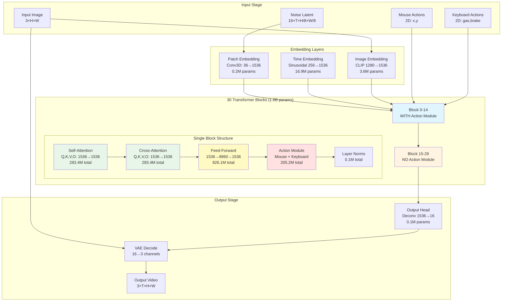
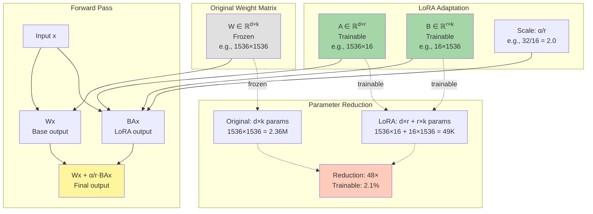
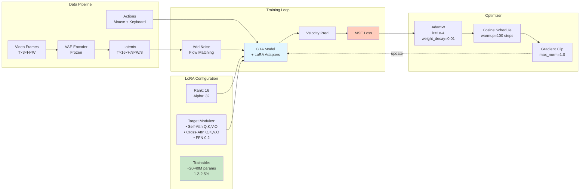

# GTA Distilled Model - Visual Architecture Diagrams

## 1. Model Architecture Overview (Mermaid)



## 2. Action Module Architecture (Mermaid)

```mermaid
graph LR
    subgraph Input["Input Features"]
        HID[Hidden States<br/>B×(T×H×W)×1536]
        MOUSE[Mouse Actions<br/>B×T×2]
        KEYS[Keyboard Actions<br/>B×T×2]
    end
    
    subgraph Mouse["Mouse Control Branch (86.9M)"]
        M1[MLP<br/>1536+24→1024]
        M2[Self-Attention<br/>16 heads, dim=64]
        M3[RoPE θ=256<br/>Temporal encoding]
        M4[Output Proj<br/>1024→1536]
    end
    
    subgraph Keyboard["Keyboard Control Branch (71.0M)"]
        K1[Embedding<br/>2→128→128]
        K2[Cross-Attention<br/>Q: 1536→1024<br/>K,V: 128→1024]
        K3[RoPE θ=256<br/>Temporal encoding]
        K4[Output Proj<br/>1024→1536]
    end
    
    subgraph Output["Combined Output"]
        ADD1[Add Mouse]
        ADD2[Add Keyboard]
        OUT[Updated Features<br/>B×(T×H×W)×1536]
    end
    
    HID --> M1
    MOUSE --> M1
    M1 --> M2
    M2 --> M3
    M3 --> M4
    M4 --> ADD1
    
    HID --> K2
    KEYS --> K1
    K1 --> K2
    K2 --> K3
    K3 --> K4
    K4 --> ADD2
    
    HID --> ADD1
    ADD1 --> ADD2
    ADD2 --> OUT
    
    style Mouse fill:#ffe1e1
    style Keyboard fill:#e1ffe1
    style M2 fill:#ffcccc
    style K2 fill:#ccffcc
```

## 3. LoRA Adaptation Strategy (Mermaid)



## 4. Training Pipeline with LoRA (Mermaid)



## 5. Parameter Distribution (ASCII Art)

```
GTA Distilled Model Parameter Distribution (1.62B total)
═══════════════════════════════════════════════════════════════════════════

Feed-Forward Networks (826.1M, 51.0%)
█████████████████████████████████████████████████████████████████████████
█████████████████████████████████████████████████████████████████████████
█████████████████████████████████████████████████████████████████████████
█████████████████████████████████████████████████████████████████████████
█████████████████████████████████████████████████████████████████████████
██████████████████████████████████████

Self-Attention (283.4M, 17.5%)
█████████████████████████████████████████
█████████████████████████████████████████
██████████

Cross-Attention (283.4M, 17.5%)
█████████████████████████████████████████
█████████████████████████████████████████
██████████

Action Modules (205.2M, 12.7%)
███████████████████████████████████
███████████████

Other Components (21.1M, 1.3%)
███
```

## 6. LoRA Strategy Comparison (ASCII Art)

```
LoRA Strategies: Trainable Parameters vs Full Model
═══════════════════════════════════════════════════════════════════════════

Full Model (1.62B, 100%)
████████████████████████████████████████████████████████████████████  100%

Full LoRA (80-120M, ~6%)
████                                                                    6%

Attention+FFN (20-40M, ~2%)
██                                                                      2%

Attention-Only (5-10M, ~0.5%)
█                                                                     0.5%

═══════════════════════════════════════════════════════════════════════════
Quality Retained: All strategies achieve 95-99% of full fine-tuning quality
Training Speed: 4-6× faster with LoRA
Memory Savings: 25-30% less VRAM required
```

## 7. Block Structure Detail (ASCII Art)

```
┌─────────────────────────────────────────────────────────────────────┐
│                    TRANSFORMER BLOCK (30 blocks)                    │
├─────────────────────────────────────────────────────────────────────┤
│                                                                     │
│  Input: x ∈ ℝ^(B×L×1536)                                          │
│  ↓                                                                  │
│  ┌──────────────────────────────────────────────────────────┐     │
│  │ SELF-ATTENTION (283.4M params total)                     │     │
│  │  • LayerNorm                                              │     │
│  │  • Q, K, V projections: 1536 → 1536 (× 3)               │     │
│  │  • Multi-head attention (12 heads, dim 128)              │     │
│  │  • RoPE position encoding                                 │     │
│  │  • Output projection: 1536 → 1536                        │     │
│  │  • Residual connection                                    │     │
│  └──────────────────────────────────────────────────────────┘     │
│  ↓                                                                  │
│  ┌──────────────────────────────────────────────────────────┐     │
│  │ CROSS-ATTENTION (283.4M params total)                    │     │
│  │  • LayerNorm                                              │     │
│  │  • Q projection from x: 1536 → 1536                      │     │
│  │  • K, V from image context: 1536 → 1536 (× 2)           │     │
│  │  • Multi-head attention (12 heads)                        │     │
│  │  • Output projection: 1536 → 1536                        │     │
│  │  • Residual connection                                    │     │
│  └──────────────────────────────────────────────────────────┘     │
│  ↓                                                                  │
│  ┌──────────────────────────────────────────────────────────┐     │
│  │ ACTION MODULE (205.2M params, blocks 0-14 only)          │     │
│  │                                                            │     │
│  │  Mouse Branch (86.9M):                                    │     │
│  │    • Concat: [x, mouse_actions] → MLP → 1024            │     │
│  │    • Self-attention (16 heads)                            │     │
│  │    • RoPE (θ=256)                                        │     │
│  │    • Project → 1536                                       │     │
│  │                                                            │     │
│  │  Keyboard Branch (71.0M):                                 │     │
│  │    • Embed: 2 → 128                                       │     │
│  │    • Cross-attention: x as Q, keys as K,V                │     │
│  │    • RoPE (θ=256)                                        │     │
│  │    • Project → 1536                                       │     │
│  │                                                            │     │
│  │  x = x + mouse_output + keyboard_output                   │     │
│  └──────────────────────────────────────────────────────────┘     │
│  ↓                                                                  │
│  ┌──────────────────────────────────────────────────────────┐     │
│  │ FEED-FORWARD NETWORK (826.1M params total)               │     │
│  │  • LayerNorm                                              │     │
│  │  • Linear: 1536 → 8960                                   │     │
│  │  • GELU activation                                         │     │
│  │  • Linear: 8960 → 1536                                   │     │
│  │  • Residual connection                                    │     │
│  └──────────────────────────────────────────────────────────┘     │
│  ↓                                                                  │
│  Output: x ∈ ℝ^(B×L×1536)                                         │
│                                                                     │
└─────────────────────────────────────────────────────────────────────┘

Note: Blocks 0-14 have action modules, blocks 15-29 don't.
```

## 8. LoRA Application Points (Visual Map)

```
════════════════════════════════════════════════════════════════════════
            WHERE TO APPLY LoRA (Priority Order)
════════════════════════════════════════════════════════════════════════

┌─────────────────────────────────────────────────────────────────────┐
│                         BLOCK i (i = 0..29)                         │
├─────────────────────────────────────────────────────────────────────┤
│                                                                     │
│  Self-Attention                                                     │
│    [Q] ←─── HIGH PRIORITY (attention-only strategy)                │
│    [K] ←─── HIGH PRIORITY                                          │
│    [V] ←─── HIGH PRIORITY                                          │
│    [O] ←─── HIGH PRIORITY                                          │
│                                                                     │
│  Cross-Attention                                                    │
│    [Q] ←─── HIGH PRIORITY (attention-only strategy)                │
│    [K] ←─── HIGH PRIORITY                                          │
│    [V] ←─── HIGH PRIORITY                                          │
│    [O] ←─── HIGH PRIORITY                                          │
│                                                                     │
│  Action Module (blocks 0-14 only)                                  │
│    Mouse:                                                           │
│      [MLP.0] ←─── MEDIUM PRIORITY (action-focused strategy)        │
│      [MLP.2] ←─── MEDIUM PRIORITY                                  │
│      [Attn Q,K,V] ←─── LOW PRIORITY (rarely needed)                │
│      [Proj] ←─── MEDIUM PRIORITY                                   │
│                                                                     │
│    Keyboard:                                                        │
│      [Embed.0] ←─── MEDIUM PRIORITY (action-focused strategy)      │
│      [Embed.2] ←─── MEDIUM PRIORITY                                │
│      [Attn Q,K,V] ←─── LOW PRIORITY                                │
│      [Proj] ←─── MEDIUM PRIORITY                                   │
│                                                                     │
│  Feed-Forward                                                       │
│    [FFN.0] ←─── MEDIUM PRIORITY (attention+ffn strategy)           │
│    [FFN.2] ←─── MEDIUM PRIORITY                                    │
│                                                                     │
│  Normalization                                                      │
│    [Norms] ←─── SKIP (not worth it)                                │
│                                                                     │
└─────────────────────────────────────────────────────────────────────┘

Strategy Recommendations:
╔══════════════════╦══════════════════════╦════════════════════════════╗
║   Strategy       ║  Target Modules      ║  Use Case                  ║
╠══════════════════╬══════════════════════╬════════════════════════════╣
║ Attention-Only   ║  Q,K,V,O (8 total)  ║  Small dataset, fast       ║
║ Attention+FFN    ║  Above + FFN (10)   ║  Recommended for most      ║
║ Full LoRA        ║  All above (14+)    ║  Large dataset, max qual   ║
║ Action-Focused   ║  Actions + Self-Attn║  Control fine-tuning       ║
╚══════════════════╩══════════════════════╩════════════════════════════╝
```

## 9. Training Flow Diagram (ASCII)

```
Training Loop with LoRA
════════════════════════════════════════════════════════════════════════

┌──────────┐     ┌──────────┐     ┌──────────────┐
│  Frames  │────▶│   VAE    │────▶│   Latents    │
│  T×3×H×W │     │  Encode  │     │ T×16×H/8×W/8 │
└──────────┘     └──────────┘     └──────┬───────┘
                                          │
                                          ▼
                 ┌────────────────────────────────────┐
                 │  Flow Matching: Add Noise          │
                 │  noisy = t·noise + (1-t)·clean    │
                 └────────────┬───────────────────────┘
                              │
          ┌──────────┐        │        ┌────────────┐
          │  Mouse   │────────┼───────▶│            │
          │ Actions  │        │        │   Model    │
          └──────────┘        │        │  + LoRA    │
          ┌──────────┐        │        │            │
          │ Keyboard │────────┼───────▶│ (1.62B +   │
          │ Actions  │        │        │  20-40M)   │
          └──────────┘        ▼        │            │
                       ┌──────────┐    │            │
                       │ Noisy    │───▶│            │
                       │ Latents  │    └─────┬──────┘
                       └──────────┘          │
                                             ▼
                                    ┌─────────────────┐
                                    │  Velocity Pred  │
                                    │  v_pred         │
                                    └────────┬────────┘
                                             │
                   ┌─────────────────────────┴─────────┐
                   │  Loss = MSE(v_pred, v_target)     │
                   │  where v_target = noise - clean   │
                   └────────────┬──────────────────────┘
                                │
                                ▼
                     ┌────────────────────┐
                     │  Backprop          │
                     │  (only LoRA params)│
                     └─────────┬──────────┘
                               │
                               ▼
                   ┌──────────────────────┐
                   │  Optimizer Step      │
                   │  • AdamW (lr=1e-4)   │
                   │  • Grad clip (1.0)   │
                   │  • Cosine schedule   │
                   └──────────────────────┘

Iteration Speed: 2-3 it/s (vs 0.5 it/s for full fine-tuning)
Memory Usage: 18-22 GB VRAM (vs 24-32 GB)
Convergence: 5-10 epochs typical
```

---

## How to View These Diagrams

### Mermaid Diagrams
1. **GitHub**: Automatically rendered in markdown files
2. **VSCode**: Install "Markdown Preview Mermaid Support" extension
3. **Online**: Copy to https://mermaid.live for interactive viewing
4. **Obsidian**: Native mermaid support

### ASCII Diagrams
- View directly in any text editor or terminal
- Monospace font recommended for proper alignment

---

## Exporting to Other Formats

To convert these to images:

```bash
# Install mermaid-cli
npm install -g @mermaid-js/mermaid-cli

# Convert to PNG
mmdc -i ARCHITECTURE_DIAGRAM.md -o architecture.png

# Convert to SVG (better for scaling)
mmdc -i ARCHITECTURE_DIAGRAM.md -o architecture.svg
```

Or use the Python script I can generate for matplotlib-based diagrams!

